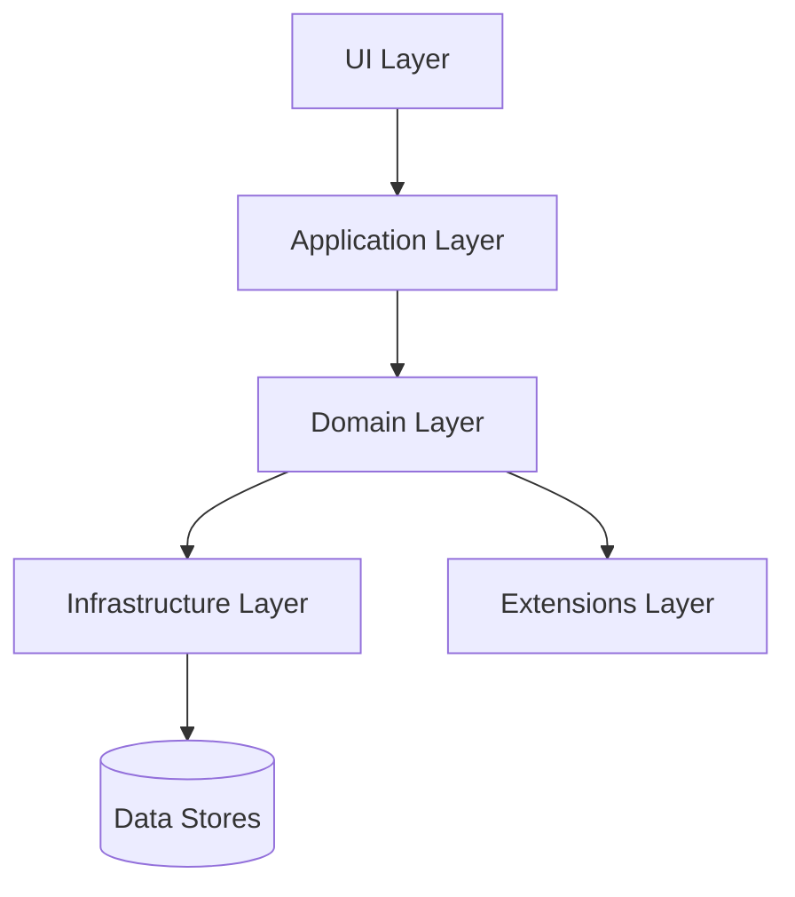

# Module Dependency Diagram

```mermaid
flowchart TD
    UI[UI Layer] --> APP[Application Layer]
    APP --> DOMAIN[Domain Layer]
    DOMAIN --> INFRA[Infrastructure Layer]
    DOMAIN --> EXT[Extensions Layer]
    INFRA --> DB[(Data Stores)]
```
